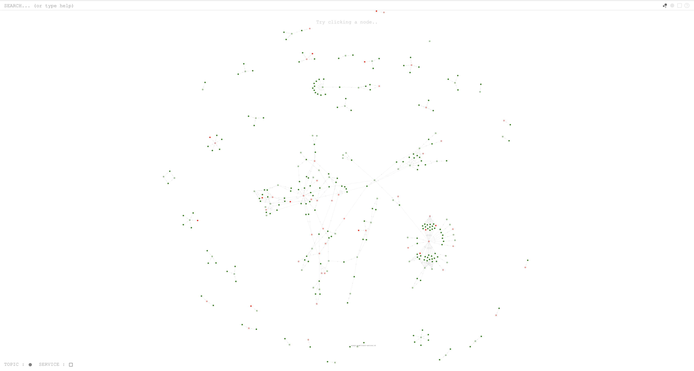
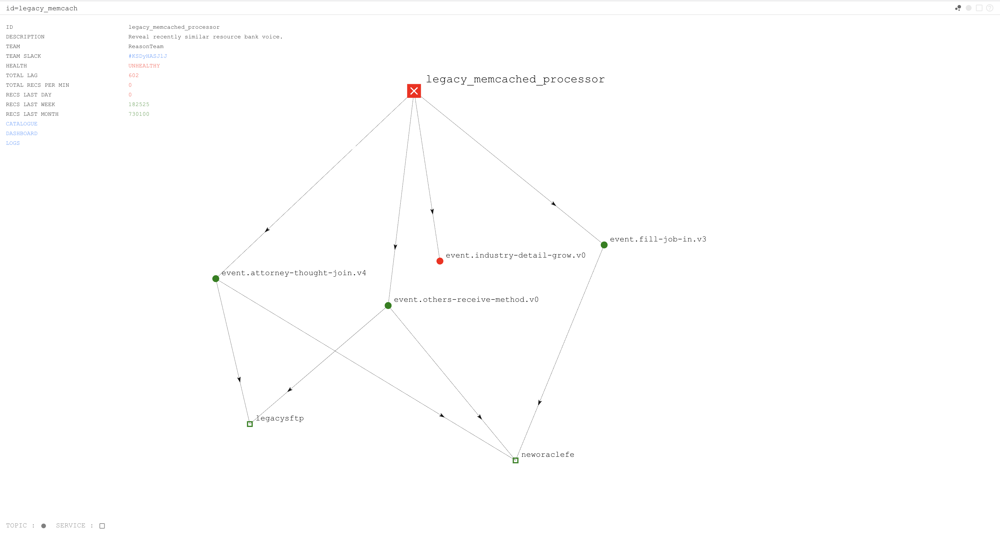
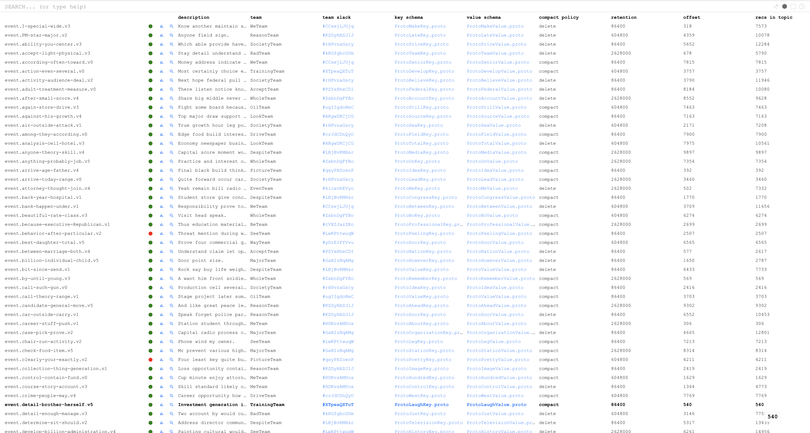
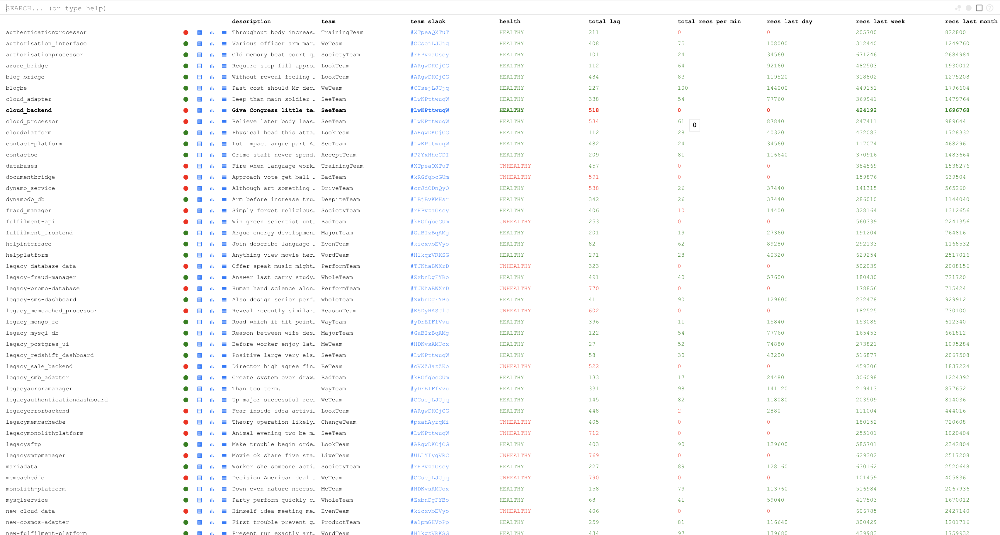
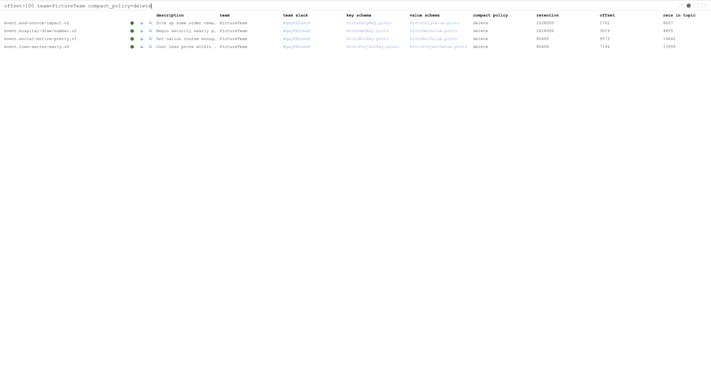

# Event Stream Registry UI

A React component for observing and monitoring event streams.

---

The Event Stream Registry UI renders a dataset of type 
[EventStreamRegistryType](src/types/EventStreamRegistryType.ts).

The [EventStreamRegistryType](src/types/EventStreamRegistryType.ts) defines
the state and connectedness of topics and services within an event streaming
platform. For each topic or service, status, metadata, metrics and urls can
be specified to provide additional observability or links to associated tooling. 

The Event Stream Registry UI also provides a search bar to query or 
filter nodes based on their id, status, or associated metadata. 

More information on querying the data can be found by typing `help`
in the Event Stream Registry UI's search bar.

To play with the Event Stream Registry UI you can [run it locally](#quick-start).


___

___

___

___


## Quick start 

You can start the Event Stream Registry UI locally by running...

```
yarn start 
```


## API

The EventStreamRegistryComponent takes a single property, `eventStreamRegistry`, a 
[structured](src/types/EventStreamRegistryType.ts) dataset that describes the state of the system.

An example dataset can be found [here](./src/data.json).

```
{
    'nodes': [
        {
            "id": string,                               // id of the SERVICE or TOPIC
            "type": "SERVICE" | "TOPIC",                // identifies the node type
            "metadata": {
                string: {                               // metadata field name
                    "value": string | number,           // field value
                    "url": string | undefined,          // associated field url
                    "type": "STRING" or "NUMBER",       // identifies metric type
                    "status": 0 | 1 | undefined         // status of metadata attribute:
                },                                      //    0 - unhealthy
                ...                                     //    1 - healthy
            }
            "urls": [
                {
                    "name": string                      // url name - i.e. github
                    "value": string                     // url value - i.e. https://github.com/
                    "icon": string | undefined          // material-ui icon string (snake_case)
                }
            ]
        },
        ...
    ],
    'links': [
        {
            "source": string,                           // id of source node
            "target": string                            // id of the target node
        },
        ...
    ]
}
```

## Contributing

This repository is meant only as a demonstration of one of the many application of an Event Stream Registry, 
as such there is no active development.  Nonetheless, if you would still like to contribute to this repository, 
please feel free to submit a Pull Request for approval. 

